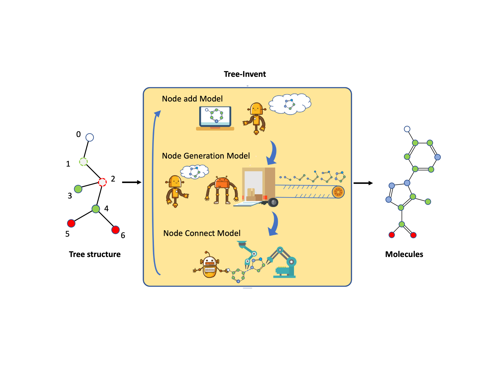
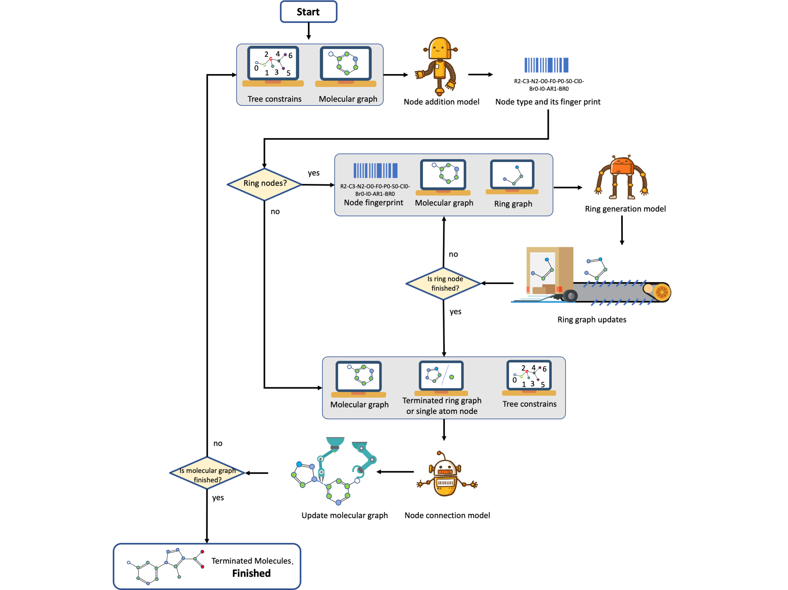

# Tree-Invent

## Description
Here a novel generative model, Tree-Invent, was proposed to integrate topological constraints in the generation of molecular graph. In this model, a molecular graph is represented as a topological tree in which ring system, non-ring atom and chemical bond are regarded as ring node, single node and edge respectively. The molecule generation is driven by three independent sub-models for carrying out operations of node addition, ring generation and node connection. One unique feature of the generative model is that topological tree structure can be specified as constraint for structure generation, which provides more precise control on structure generation. Combining with reinforcement learning, Tree-Invent model could efficiently explore targeted chemical space. Moreover, Tree-Invent model is flexible enough to be used in versatile molecule design settings such as scaffold decoration, scaffold hopping and linker generation. 

## Functions
Tree-Invent supports :
* unconstrained molecular generation. 
* constrained molecular generation with user-defined topology.
* Score guided molecular generation with reinforcement learning including:
     QED, SAScore, QSAR bio-activity, Molecular similarity, Docking score, Shape similarity.
* all the these functions can be combined flexibly for both scaffold hopping, decoration and linker generation.

## Basic workflow

## Contributors:
[@Mingyuan Xu](https://github.com/MingyuanXu)

## Examples
* comming soon

